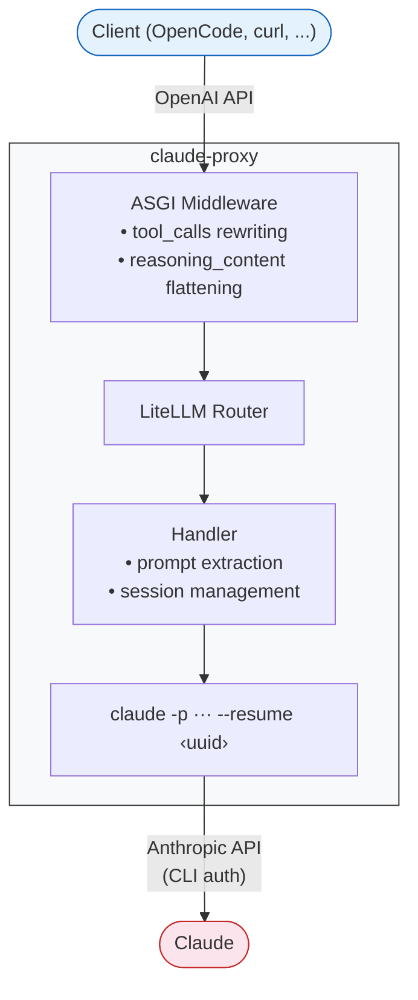

# claude-proxy

OpenAI-compatible proxy that routes requests to the Claude CLI.

> **Disclaimer** — This project invokes the official Claude CLI as a subprocess using your own authenticated session. No credentials are intercepted or stored, no authentication mechanisms are bypassed, and no proprietary protocols are reverse-engineered. You are solely responsible for ensuring your use complies with Anthropic's [Terms of Service](https://www.anthropic.com/legal/consumer-terms) and [Acceptable Use Policy](https://www.anthropic.com/legal/aup), which may change at any time. This software is provided as-is, without warranty of any kind.

<details>
<summary><strong>Table of contents</strong></summary>

- [Prerequisites](#prerequisites)
- [Install](#install)
- [Quick start](#quick-start)
- [CLI reference](#cli-reference)
- [Models](#models)
- [Sessions](#sessions)
- [Tools](#tools)
- [System prompt](#system-prompt)
- [API usage](#api-usage)
- [OpenCode](#opencode)
- [Architecture](#architecture)
- [Development](#development)

</details>

## Prerequisites

- Python 3.13+
- [uv](https://docs.astral.sh/uv/)
- [Claude Code CLI](https://docs.anthropic.com/en/docs/claude-code) installed and authenticated

## Install

```bash
git clone https://github.com/mesca/claude-proxy.git
uv tool install ./claude-proxy
```

To update after pulling new changes:

```bash
cd claude-proxy && git pull
uv cache clean claude-proxy && uv tool install --force --no-cache .
```

## Quick start

```bash
claude-proxy
```

The proxy starts on `http://127.0.0.1:4000` and accepts standard OpenAI API requests.

Run in the background with tmux:

```bash
tmux new -d -s proxy 'claude-proxy'   # start
tmux attach -t proxy                   # logs (Ctrl+B D to detach)
tmux kill-session -t proxy             # stop
```

## CLI reference

```
claude-proxy [options] [command]
```

| Flag | Default | Description |
|---|---|---|
| `--host HOST` | `127.0.0.1` | Listen address |
| `--port PORT` | `4000` | Listen port |
| `--session-header HEADER` | auto-discover | HTTP header for session affinity |
| `--stateless` | off | Disable sessions — send full conversation history each turn |
| `-v, --version` | | Show version and exit |
| `-h, --help` | | Show help and exit |

| Command | Description |
|---|---|
| `list-models` | Show available models with their Claude CLI flags |

```bash
claude-proxy                                # default: 127.0.0.1:4000
claude-proxy --host 0.0.0.0 --port 8080    # custom host and port
claude-proxy --stateless                    # no session affinity, full history each turn
claude-proxy --session-header x-session-id  # custom session header
claude-proxy list-models                    # show models
```

## Models

| Model name | Effort |
|---|---|
| `claude-opus-4-6` | default |
| `claude-opus-4-6-high` | high |
| `claude-opus-4-6-max` | max (extended thinking) |
| `claude-sonnet-4-6` | default |
| `claude-sonnet-4-6-high` | high |
| `claude-sonnet-4-6-max` | max (extended thinking) |
| `claude-haiku-4-5` | default |
| `claude-haiku-4-5-high` | high |
| `claude-haiku-4-5-max` | max (extended thinking) |

Extended thinking content is sent as `reasoning_content` in SSE chunks.

## Sessions

The proxy maintains Claude CLI sessions across requests for conversation continuity and prompt caching (up to 90% cost savings on repeated context).

A session header is auto-discovered from each request. A deterministic UUID is derived from the header value and used to resume the CLI session via `--resume`. No server-side state — sessions are persisted to disk by the CLI and survive proxy restarts.

Well-known headers (checked in order): `x-session-affinity` (OpenCode), `x-session-id`, `x-conversation-id`. Use `--session-header` to override. If no header is found, the proxy falls back to stateless mode with a warning.

In stateless mode (`--stateless`), sessions are disabled and the full conversation history is formatted and sent as the prompt each turn. Context is preserved, but there is no prompt caching across turns.

## Tools

The proxy supports the OpenAI tool calling protocol. Neither the proxy nor Claude execute tools — all tool execution happens on the **client side** (e.g. OpenCode).

When Claude responds with a `{"tool_calls": ...}` JSON object, the proxy rewrites it into a proper OpenAI `tool_calls` response with `finish_reason: "tool_calls"`. The client executes the tools and sends results back as `tool` role messages. No configuration required.

## System prompt

The client's `system` message replaces Claude's default system prompt. This gives Claude a clean slate: no built-in tool descriptions, no CLAUDE.md, no project context — only what the client sends. When no `system` message is present, a generic fallback is used.

## API usage

### Non-streaming

```bash
curl http://localhost:4000/v1/chat/completions \
  -H "Content-Type: application/json" \
  -d '{
    "model": "claude-sonnet-4-6",
    "messages": [{"role": "user", "content": "Hello!"}]
  }'
```

### Streaming

```bash
curl http://localhost:4000/v1/chat/completions \
  -H "Content-Type: application/json" \
  -d '{
    "model": "claude-sonnet-4-6-max",
    "messages": [{"role": "user", "content": "What is 99*101?"}],
    "stream": true
  }'
```

## OpenCode

Add this to your `opencode.json` (project root or `~/.config/opencode/opencode.json`):

```json
{
  "$schema": "https://opencode.ai/config.json",
  "model": "claude-proxy/claude-sonnet-4-6",
  "provider": {
    "claude-proxy": {
      "npm": "@ai-sdk/openai-compatible",
      "name": "Claude Proxy",
      "options": {
        "baseURL": "http://localhost:4000/v1",
        "apiKey": "not-needed"
      },
      "models": {
        "claude-opus-4-6": { "name": "Claude Opus 4.6" },
        "claude-opus-4-6-high": { "name": "Claude Opus 4.6 (high effort)" },
        "claude-opus-4-6-max": { "name": "Claude Opus 4.6 (max effort)" },
        "claude-sonnet-4-6": { "name": "Claude Sonnet 4.6" },
        "claude-sonnet-4-6-high": { "name": "Claude Sonnet 4.6 (high effort)" },
        "claude-sonnet-4-6-max": { "name": "Claude Sonnet 4.6 (max effort)" },
        "claude-haiku-4-5": { "name": "Claude Haiku 4.5" },
        "claude-haiku-4-5-high": { "name": "Claude Haiku 4.5 (high effort)" },
        "claude-haiku-4-5-max": { "name": "Claude Haiku 4.5 (max effort)" }
      }
    }
  }
}
```

### With Serena MCP

[Serena](https://github.com/oraios/serena) provides code intelligence tools (find symbols, read definitions, navigate references). Add a `mcp` section to your `opencode.json`:

```json
  "mcp": {
    "serena": {
      "type": "local",
      "command": ["uvx", "--from", "serena-agent", "serena", "start-mcp-server", "--project-from-cwd"]
    }
  }
```

OpenCode sends Serena's tools to the proxy, Claude calls them via `tool_calls`, and OpenCode executes them locally.

**Test prompt**: `Show me the body of the main function and list all symbols in the entry point file.`

---

## Architecture



Claude is sandboxed as a pure LLM — all built-in tools, skills, and MCP servers are disabled:

| Flag | Purpose |
|---|---|
| `--tools ""` | Remove built-in tool descriptions from prompt |
| `--allowedTools ""` | Block execution of any remaining tools |
| `--disable-slash-commands` | Disable all skills |
| `--strict-mcp-config` | Disable all MCP servers |
| `--system-prompt` | Replace default system prompt with client's |

## Development

```bash
git clone https://github.com/mesca/claude-proxy.git
cd claude-proxy
uv sync --all-groups
uv run pytest              # run tests
uv run ruff check .        # lint
```

### Adding models

When new Claude models become available, edit `MODELS` in `claude_proxy/models.py`:

```python
MODELS = [
    {"alias": "opus", "name": "claude-opus-4-6"},
    {"alias": "sonnet", "name": "claude-sonnet-4-6"},
    {"alias": "haiku", "name": "claude-haiku-4-5"},
]
```

The `alias` is the CLI `--model` value. The `name` is the model ID exposed to clients. Effort variants (`-high`, `-max`) are generated automatically. Reinstall after editing.

Reference: [Anthropic model IDs](https://docs.anthropic.com/en/docs/about-claude/models)
